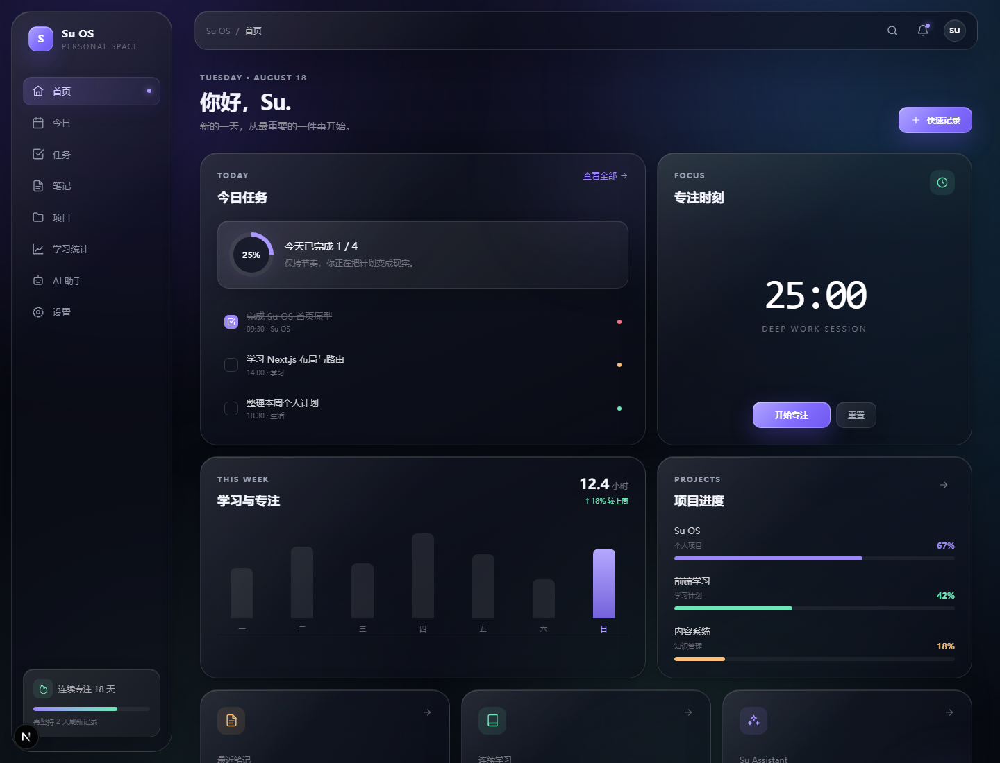
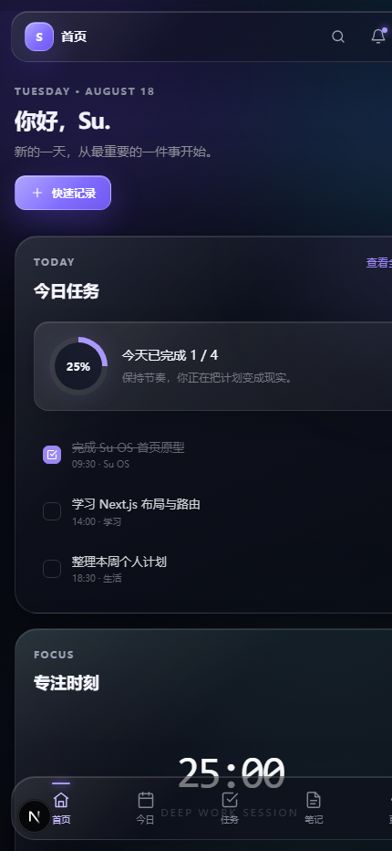

# Su OS

Su OS 是一个面向个人使用的响应式 Personal OS。v0.2 已从展示型 MVP 升级为可日常使用的本地优先工作台，用于集中管理任务、笔记、项目、学习数据、专注记录与 AI 助手界面。

当前版本采用精致的纯 CSS「液态玻璃」视觉风格，在不引入 WebGL 或重型特效库的前提下，实现半透明玻璃、背景模糊、边缘高光、渐变光晕与轻量动态效果，同时兼顾桌面端和手机端使用。

GitHub 私有仓库：[Su457/Su-os](https://github.com/Su457/Su-os)

## 界面预览

### 桌面端



### 手机端



## 设计特点

- 深色液态玻璃视觉系统
- 半透明卡片、悬浮导航与柔和边缘高光
- 多层渐变光晕和细腻背景纹理
- 桌面端侧边栏与手机端底部导航
- 响应式布局，适配不同屏幕尺寸
- 支持 `backdrop-filter` 的浏览器使用增强玻璃效果
- 为不支持玻璃模糊的浏览器提供可读性降级方案
- 尊重系统的“减少动态效果”设置

## v0.2 当前功能

- Dashboard 从统一数据层实时汇总今日任务、MIT、专注、学习、项目进度和最近笔记
- Tasks 支持新增、编辑、删除、完成、日期/时间、优先级、项目、标签、搜索和组合筛选
- Today 直接读取当天任务，支持最多 3 个 MIT、排序和关联任务启动专注
- Notes 支持自动保存、全文搜索、标签、收藏、归档与项目关联
- Projects 支持完整状态管理、自动任务进度、关联任务/笔记和里程碑管理
- Learning 支持学习记录 CRUD、自动时长计算、7 日趋势、科目统计与连续学习天数
- Focus 完成后记录任务、项目、起止时间和专注分钟数
- Settings 支持 JSON 导入导出、恢复演示数据与清空本地数据
- AI 助手继续使用本地演示回复，不连接真实模型

所有核心数据统一保存在当前浏览器的 `localStorage` 中。刷新或关闭页面后数据仍然存在，但尚未接入登录、数据库或云同步。

## 技术栈

- Next.js 16
- React 19
- TypeScript
- Tailwind CSS 4
- 纯 CSS 液态玻璃效果

## 项目结构

```text
src/
├─ app/                    Next.js 页面、全局样式和路由入口
│  ├─ globals.css          液态玻璃视觉系统和响应式样式
│  ├─ page.tsx             Dashboard 首页
│  ├─ ai/                  AI 助手路由
│  ├─ learning/            学习统计路由
│  ├─ notes/               笔记路由
│  ├─ projects/            项目路由
│  ├─ settings/            设置路由
│  ├─ tasks/               任务管理路由
│  └─ today/               今日任务路由
├─ components/
│  ├─ ai/                  AI 助手界面
│  ├─ dashboard/           Dashboard 内容
│  ├─ focus/               专注计时与记录
│  ├─ learning/            学习记录与统计
│  ├─ layout/              页面骨架、侧边栏、顶栏和手机导航
│  ├─ notes/               笔记列表与自动保存编辑器
│  ├─ projects/            项目、项目表单和里程碑
│  ├─ settings/            设置与本地数据管理
│  ├─ tasks/               任务列表、表单和筛选
│  ├─ today/               今日任务与 MIT
│  └─ ui/                  通用图标和页面组件
└─ lib/
   ├─ types.ts             统一业务数据模型
   ├─ default-data.ts      首次运行的演示数据
   ├─ date-utils.ts        本地日期和统计工具
   ├─ storage/             可替换的数据仓储边界
   └─ store/               React Context 统一状态层
```

## 设计与开发约定

- 优先保持纯 CSS 方案，不依赖 WebGL 或大型视觉特效库。
- 新页面应复用现有玻璃卡片、按钮、输入框和导航样式。
- 桌面端使用侧边栏，手机端使用底部导航；修改布局时需要同时验证两端。
- 文字可读性优先于透明度和模糊强度。
- 动效应轻量，并继续支持系统的“减少动态效果”设置。
- 运行时组件只通过统一 Store 读写数据，不直接操作 `localStorage`。
- `src/lib/mock-data.ts` 仅保留为旧导入兼容入口；首次演示数据位于 `src/lib/default-data.ts`。

## 本地数据与备份

- 存储键：`su-os:data:v2`
- 数据格式包含 `schemaVersion: 2`，方便后续迁移
- 设置页可以导出完整 JSON 备份，也可以从同版本 JSON 恢复
- “重置为演示数据”和“清空全部数据”会替换当前浏览器中的数据，操作前建议先导出
- 浏览器清理站点数据、无痕模式结束或更换设备都会导致本地数据不可用；v0.2 不提供跨设备同步

## 本地运行

安装依赖：

```bash
npm install
```

启动开发预览：

```bash
npm run dev
```

电脑浏览器打开：

```text
http://localhost:3000
```

## 手机端查看

1. 确保手机与电脑连接同一个 Wi-Fi。
2. 启动开发预览，并确保服务允许局域网访问。
3. 查询电脑当前的局域网 IPv4 地址。
4. 在手机浏览器中打开 `http://电脑IP:3000`。

示例：

```text
http://10.183.33.39:3000
```

局域网地址可能在切换 Wi-Fi 或重启网络后发生变化，应以电脑当前地址为准。如果手机无法访问，请检查系统防火墙、VPN、代理设置，以及路由器是否启用了设备隔离。

## 可用命令

```bash
npm run dev
npm run lint
npm run build
npm run start
```

## 项目状态

v0.2 是可实际使用的本地优先版本。后续可以用 Supabase Repository 替换当前 LocalStorage Repository，但本版本不包含账号、后端、云同步、PWA 或真实 AI API。

## AI 协作说明

其他 AI 或开发者接手项目前，建议按以下顺序了解代码：

1. 阅读本 README，确认当前范围和技术边界。
2. 查看 `src/app/globals.css`，了解视觉变量和玻璃组件样式。
3. 查看 `src/components/layout/app-shell.tsx`，了解整体响应式布局。
4. 查看 `src/lib/types.ts`、`src/lib/store/su-os-store.tsx` 和各业务组件目录，了解数据流与页面组织方式。
5. 修改完成后运行 `npm run lint` 和 `npm run build`。

私有仓库不会因分享链接而自动开放访问。AI 工具需要通过已授权的 GitHub 连接、协作者账号或本地项目目录读取代码。
